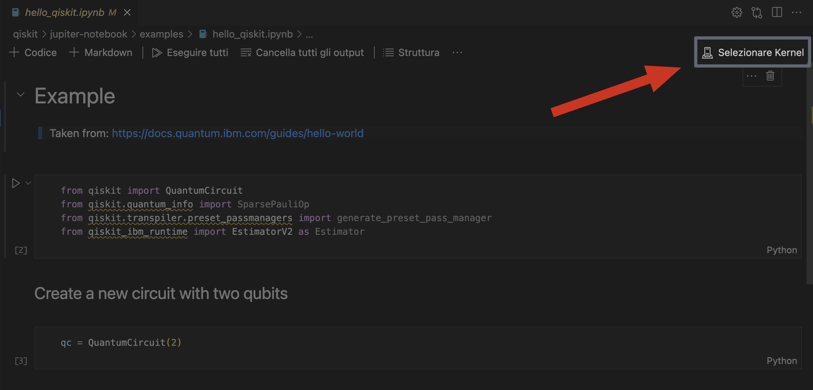
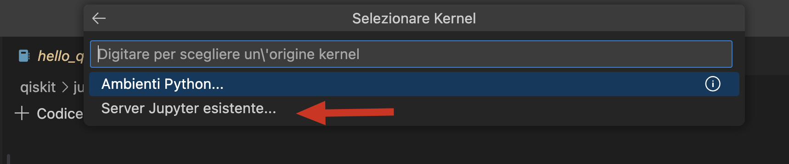
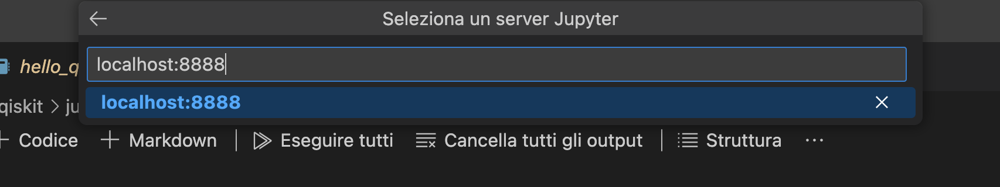

# Quantum Portfolio Optimization
Realizzato da:
- [Colli Simone](https://github.com/simonecolli)
- [Merenda Saverio Mattia](https://github.com/merendamattia)

In questo elaborato esploriamo l'applicazione del calcolo quantistico all'ottimizzazione del portafoglio in ambito finanziario, confrontando i metodi classici  con gli approcci quantistici basati su VQE (Variational Quantum Eigensolver) e QAOA (Quantum Approximate Optimization Algorithm). Formuliamo il problema dell'ottimizzazione del portafoglio come un problema QUBO (Quadratic Unconstrained Binary Optimization) e lo implementiamo utilizzando il framework Qiskit. Lo studio include simulazioni sia in assenza che in presenza di rumore per valutare le prestazioni degli algoritmi in condizioni realistiche. La ricerca evidenzia le attuali limitazioni nel scalare l'ottimizzazione quantistica del portafoglio alle applicazioni del mondo reale, principalmente a causa dei vincoli hardware e dell'impatto del rumore su sistemi più grandi. 

## Requisiti per l'utilizzo
Per utilizzare il sistema, è necessario avere i seguenti strumenti installati:
-   [Docker](https://docs.docker.com/engine/install/)
-   [Docker Compose](https://docs.docker.com/compose/install/)

Verifica l'installazione con i seguenti comandi:
```bash
docker --version
docker compose version
```

## Build e Run 
Per costruire il container:
```bash
docker compose up --build --no-cache --no-start
```

Per eseguire il container:
```bash
docker compose up -d
```

> Questo comando avvierà il container in background e condividerà le sessioni con l'host sulla porta 8888.

### Stop 
Per terminare il container:

```bash
docker compose stop
```

---

## Utilizzo
Per utilizzare l'ambiente installato, puoi accedere al server Jupiter Notebook aprendo il seguente URL nel tuo browser web:

```
http://localhost:8888
```

### VScode integration
Se utilizzi VScode, puoi installare l'estensione [Jupiter](https://marketplace.visualstudio.com/items?itemName=ms-toolsai.jupyter) per modificare i file `.ipynb`, senza interagire con l'interfaccia del browser web.

Una volta fatto ciò, puoi impostare il kernel Jupiter su `localhost:8888`. Questo ti consente di eseguire il file Jupiter in locale.




